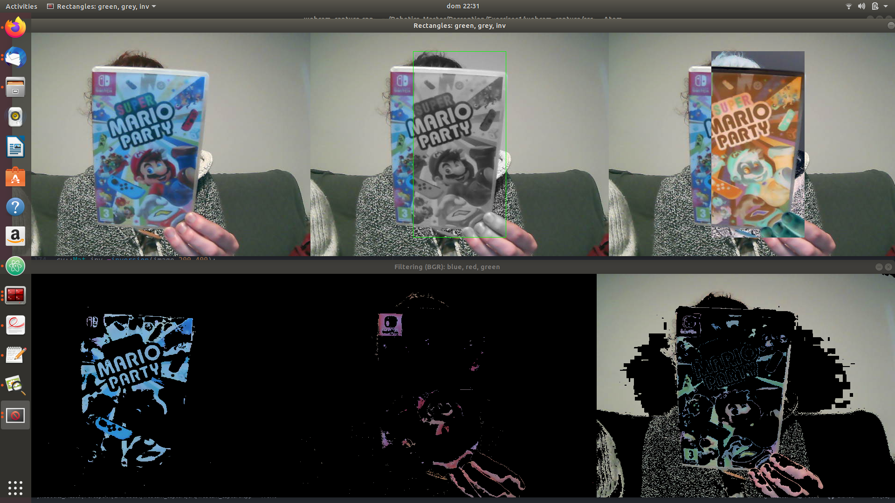

## webcam_capture
Just webcam capture
see in [webcam_capture](https://github.com/easyrobotic/webcam_capture.git)

## Tips
https://wiki.archlinux.org/index.php/webcam_setup

http://www.linuxintro.org/wiki/Set_up_a_Webcam_with_Linux

## CODE

There are the following functions:

0. **obtain_intensity**(input image) -> it returns the intensity of the central pixel of the input image.
1. **draw_blue_point**(input image) -> it returns an image with its central pixel in blue;
2. **green_rectangle**(input image,rectangle width, rectangle height) -> it returns an image with a green color rectangle on its center;
3. **convert_gray**(input image, rectangle width, rectangle height) -> it returns an image with a grayscale color rectangle located in the center of the image;
4. **inversion**(input image,rectangle width,rectangle height)-> it returns an image with a inverted color rectangle located in the center of the image;

### Adding color filtering.

5. **blue_filtering**(input image,int width, int height) -> it returns the input image with blue filtration;
6. **red_filtering**(input image,int width, int height)) -> it returns the input image with red filtration;
7. **green_filtering**(input image,int width, int height)) -> it returns the input image with green filtration;

### Output
It obtains the following images:
1. Images with a changed rectangle: original image, grayscale rectangle, inverted rectangle;
2. Images with a filtering: blue, red, green;

## Run the code

1. Make a new directory named build
2. go to build and execute *cmake ..* and then *make*.
3. Run file *./webcam_capture* - (you have to have a webcam previously installed).
